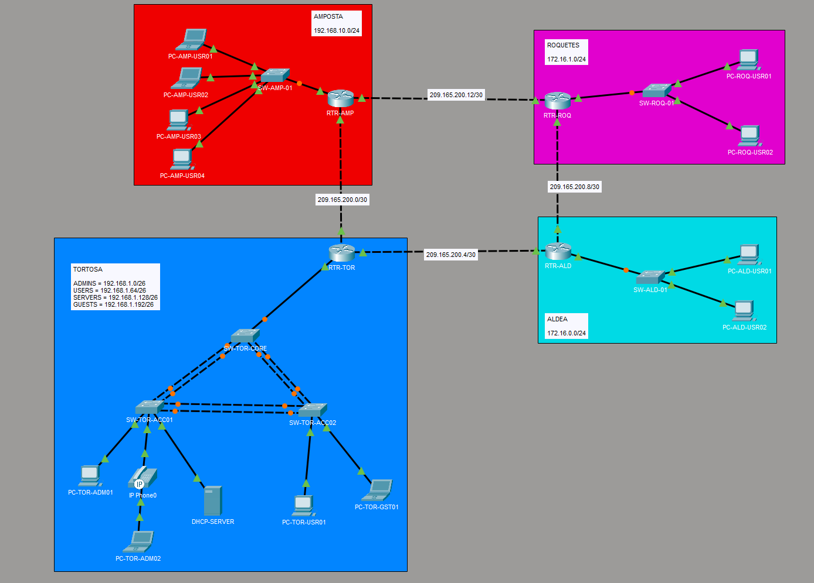

# 2. Diseño de red

## 2.1 Descripción de la arquitectura

La infraestructura está diseñada como una red empresarial multisede
compuesta por cuatro ubicaciones:

- **Tortosa**
- **Amposta**
- **Roquetes**
- **L'Aldea**

Las diferentes sedes están interconectadas mediante enlaces punto a
punto entre routers. El routing entre las diferentes redes se realiza
mediante OSPF.

La sede de Tortosa actúa como sede principal y presenta una arquitectura
de red segmentada mediante VLAN, con diferentes redes destinadas a
administración, usuarios, servidores, invitados y telefonía IP.

## 2.2 Topología de red

La topología completa de la infraestructura se representa en el
siguiente diagrama.

## 2.3 Sede de Tortosa

Tortosa es la sede principal de la infraestructura.

La red local está segmentada mediante diferentes VLAN:

- **VLAN 10 - ADMIN:** dispositivos destinados a tareas de administración.
- **VLAN 20 - USERS:** dispositivos de usuarios.
- **VLAN 30 - SERVERS:** servidores y servicios de red.
- **VLAN 40 - GUESTS:** dispositivos pertenecientes a la red de invitados.
- **VLAN 50 - VOICE:** tráfico destinado a telefonía IP.
- **VLAN 99 - NATIVE:** VLAN nativa utilizada en los enlaces trunk.

El routing entre las diferentes VLAN se realiza mediante subinterfaces
802.1Q en el router **RTR-TOR**.

La infraestructura de switching está formada por un switch principal
y dos switches de acceso conectados mediante enlaces agregados
EtherChannel utilizando LACP.

## 2.4 Sede de Amposta

La sede de Amposta dispone de una red local independiente:

- Red: `192.168.10.0/24`
- Gateway: `192.168.10.1`

El servicio DHCP de esta sede es proporcionado directamente por
**RTR-AMP**.

La sede está conectada al resto de la infraestructura mediante enlaces
punto a punto y participa en el dominio de routing OSPF.

## 2.5 Sede de Roquetes

La sede de Roquetes dispone de una red local independiente:

- Red: `172.16.1.0/24`
- Gateway: `172.16.1.1`

Los dispositivos de esta sede utilizan direccionamiento estático.

La sede participa en el dominio de routing OSPF y mantiene conectividad
con el resto de las ubicaciones.

## 2.6 Sede de L'Aldea

La sede de L'Aldea dispone de una red local independiente:

- Red: `172.16.0.0/24`
- Gateway: `172.16.0.1`

Los dispositivos de esta sede utilizan direccionamiento estático.

La sede participa en el dominio de routing OSPF y mantiene conectividad
con el resto de las ubicaciones.

## 2.7 Interconexión entre sedes

Las diferentes sedes están conectadas mediante enlaces punto a punto
utilizando redes `/30`.

Estas redes permiten utilizar dos direcciones IP por enlace, una para
cada extremo del enlace, reduciendo el desperdicio de direcciones.

El routing dinámico entre las diferentes sedes se realiza mediante
OSPF, permitiendo que los routers intercambien información sobre las
redes disponibles y seleccionen dinámicamente las rutas.

## 2.8 Redundancia

La topología incorpora varios caminos entre las diferentes sedes.

Esta configuración permite disponer de rutas alternativas en caso de
fallo de alguno de los enlaces.

OSPF se utiliza para gestionar dinámicamente estas rutas y permitir la
convergencia de la red ante cambios en la topología.
